[](https://classroom.github.com/a/USx538Ll)
[](https://classroom.github.com/online_ide?assignment_repo_id=17032340&assignment_repo_type=AssignmentRepo)

# Detecció d'Ictus a Través de Models de Machine Learning

---

## **Objectiu del Projecte**
Aquest projecte té com a finalitat desenvolupar models de Machine Learning per detectar casos d'ictus (stroke) utilitzant dades clíniques. L'objectiu principal és determinar si els models poden identificar casos d'ictus amb precisió i si també poden fer-ho utilitzant exclusivament característiques que no es consideren del tipus médic. Aquest enfocament podria facilitar una detecció preliminar que permeti prevenir riscos de forma més accessible i eficient, així com permetre a les persones sense accessibilitat a recursos médics detectar si son proactius a patir un ictus.

---

## **Dataset Utilitzat**
El dataset utilitzat prové de [Kaggle](https://www.kaggle.com/datasets/fedesoriano/stroke-prediction-dataset) i conté dades de 5.110 pacients amb les següent característiques:

1. **id**: Identificador únic del pacient.
2. **gender**: "Male", "Female" o "Other".
3. **age**: Edat del pacient.
4. **hypertension**: 0 si el pacient no té hipertensió, 1 si en té.
5. **heart_disease**: 0 si no té malalties cardíacques, 1 si en té.
6. **ever_married**: "No" o "Yes".
7. **work_type**: "children", "Govt_job", "Never_worked", "Private" o "Self-employed".
8. **Residence_type**: "Rural" o "Urban".
9. **avg_glucose_level**: Nivell mitjà de glucosa a la sang.
10. **bmi**: Índex de massa corporal.
11. **smoking_status**: "formerly smoked", "never smoked", "smokes" o "Unknown".
12. **stroke**: 1 si el pacient ha patit un ictus, 0 en cas contrari.

El dataset presentava un desbalanceig significatiu: només aproximadament 250 casos (5%) tenien `stroke = 1`. Aquest problema es va abordar aplicant **SMOTE** (Synthetic Minority Over-sampling Technique) per equilibrar les classes durant l'entrenament, garantint que les proves reflectissin la realitat i no un escenari artificialment balancejat.

---

## **Llibreries Utilitzades**
- `numpy`, `pandas`: Per a la gestió i manipulació de dades.
- `scikit-learn`: Per a la divisó de dades, implementació de models i càlcul de mètriques.
- `imblearn`: Per aplicar SMOTE.
- `matplotlib`, `seaborn`: Per a la generació de gràfics.
- **Mòduls personalitzats**:
  - `dataloader_module`: Carrega i prepara les dades.
  - `metrics_module`: Calcula les mètriques necessàries.
  - `graphs_module`: Genera gràfics com ROC curves.

---

## **Models de Classificació Aplicats**
1. Logistic Regression
2. Random Forest
3. Naive Bayes
4. K-Nearest Neighbors (KNN)
5. AdaBoost
6. XGBoost

Els models es van avaluar amb i sense les característiques següents:
- `bmi`
- `obesity`
- `avg_glucose_level`
- `hypertension`
- `heart_disease`

Els criteris d'èxit incloïen la precisió (`accuracy`), el **recall** (prioritzat en aquest projecte), i l'àrea sota la corba ROC (AUC-ROC).

## **Justificació de la No Implementació de Grid Search**

Durant el desenvolupament del projecte, vam considerar la possibilitat d'utilitzar GridSearchCV per a la cerca d'hiperparàmetres amb l'objectiu de maximitzar tant el recall com l'accuracy de manera equilibrada. No obstant això, després de diverses proves i avaluacions, vam observar que la combinació d'aquestes dues mètriques en la cerca d'hiperparàmetres no produïa els resultats esperats.

En concret, vam trobar que:

- Mètriques Nefastes: Quan intentàvem maximitzar simultàniament el recall i l'accuracy, els models resultants presentaven   mètriques de rendiment subòptimes. Això es devia al fet que la combinació d'aquestes dues mètriques en una sola funció d'avaluació no reflectia adequadament el compromís necessari entre elles.

- Compromís entre Recall i Accuracy: Maximitzar el recall sovint implica acceptar un major nombre de falsos positius, mentre que maximitzar l'accuracy pot implicar un compromís en la detecció de casos positius. Aquest compromís inherent va dificultar la cerca d'una configuració d'hiperparàmetres que equilibrés ambdues mètriques de manera satisfactòria.

- Complexitat i Temps de Càlcul: La cerca d'hiperparàmetres amb GridSearchCV és computacionalment intensiva, especialment quan es treballa amb conjunts de dades grans i graelles d'hiperparàmetres extenses. Els resultats subòptims obtinguts no justificaven el temps i els recursos invertits en aquesta cerca.

Per aquestes raons, vam decidir no implementar GridSearchCV en la nostra metodologia final. En lloc d'això, vam optar per ajustar-ho manualment a través del threshold, prioritzant el recall per assegurar-nos que els casos positius fossin detectats de manera efectiva, mentre manteníem una accuracy acceptable.

Aquesta decisió ens va permetre obtenir models amb un millor rendiment global, adaptats a les necessitats específiques del projecte, sense comprometre excessivament cap de les dues mètriques clau.

## **Reproducció del Projecte**

### **Requisits**
1. **Python 3.8+**.
2. Llibreries necessàries (es poden instal·lar amb `pip`):
   ```bash
   pip install -r requirements.txt
   ```

---

## **Resultats**
Els resultats inclouen:
- **Mètriques** dels millors models seleccionats:

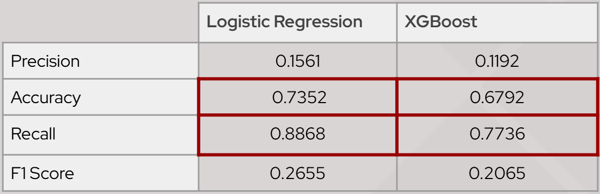

- **Matrius de confusió** que mostren dels millors models:
<div style="display: flex; flex-wrap: wrap; gap: 10px;">
  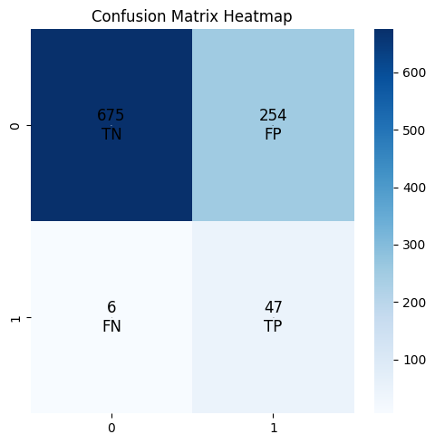
  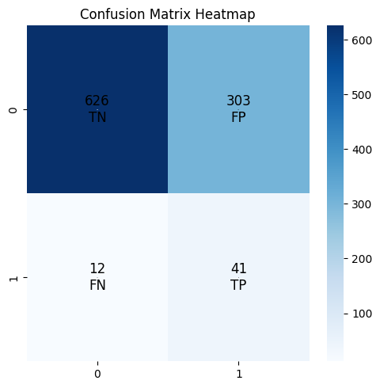
</div>

- **ROC curves** que comparen tots els models amb les dades completes i amb les dades reduïdes:

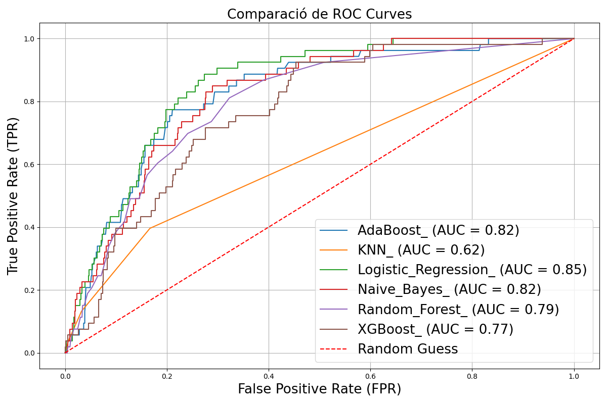
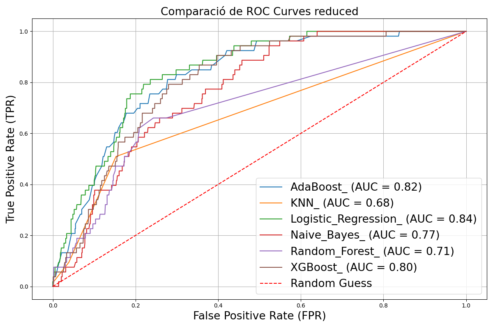

- Comparatives de corbes ROC entre models:

<div style="display: flex; flex-wrap: wrap; gap: 10px;">
  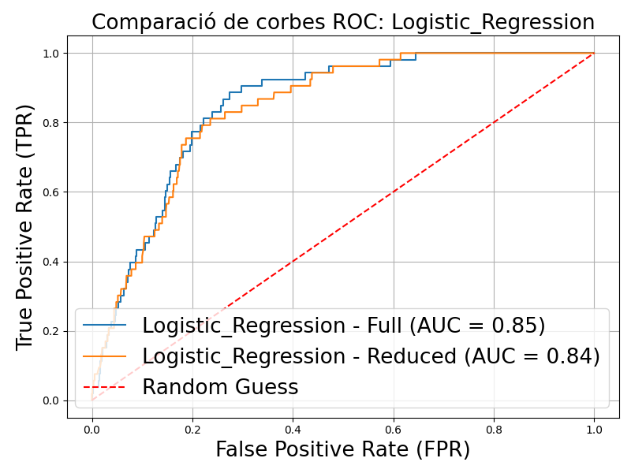
  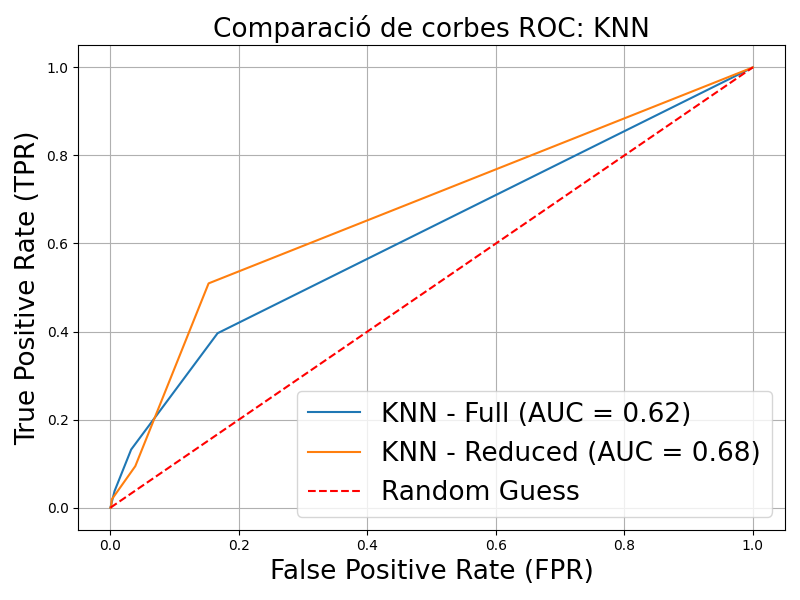
  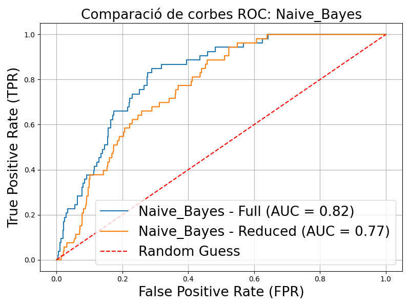
  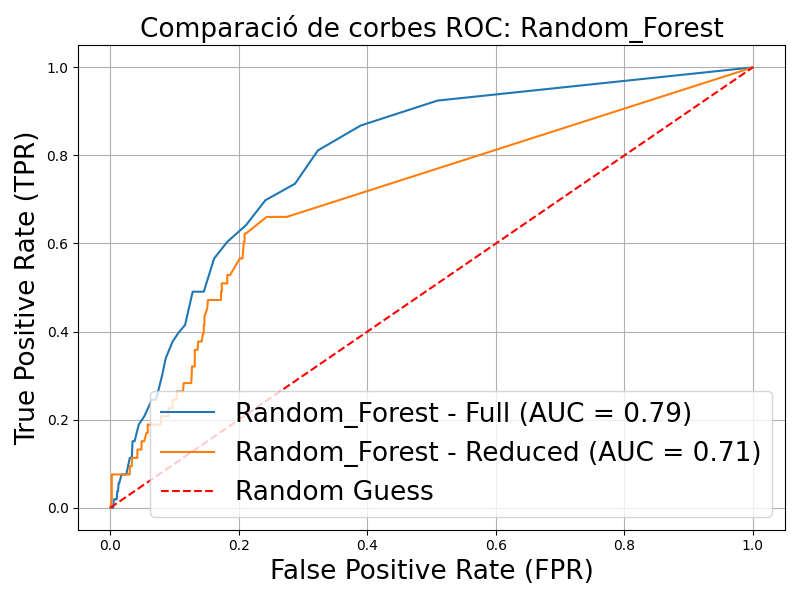
  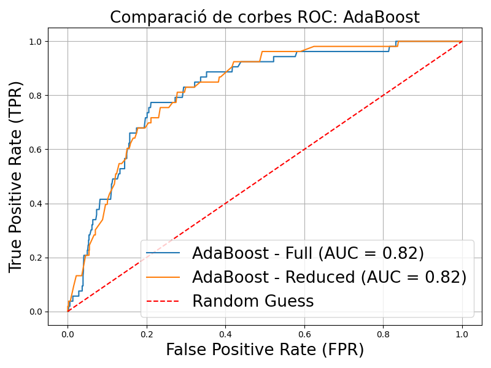
  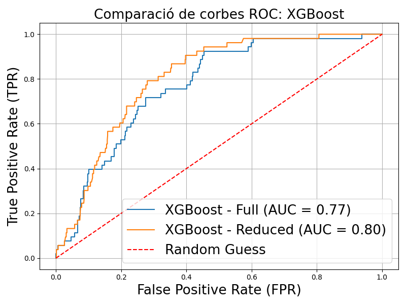
</div>

### **Observació Inicial**
Els models mostren una disminució de la precisió quan es redueixen les característiques, tot i que encara és possible detectar ictus amb una fiabilitat raonable. Els models de Regressió Logística i XGBoost van ser els més robustos, especialment quan es prioritzava el recall.

---

## **Conclusions**
1. És possible detectar casos d'ictus amb dades que tenim, amb una Accuracy de 74% i un Recall del 89% per la regressió logística.
2. La priorització del recall és clau per minimitzar els falsos negatius, donada la gravetat d'un ictus no detectat.
3. És possible detectar ictus amb característiques mesurables a casa, encara que els valors de les mètriques disminueixin lleugerament, depenent del model.

### **Millora Futura**
1. Incorporar dades addicionals per augmentar la robustesa dels models, especialment de casos positius (ictus). Això inclou més tipus de dades (historial alimentari, activitat física, etc.), i cantitats més grans de dades de pacients amb ictus.

---

## **Estructura del Repositori**
```plaintext
├── data/                     # Conté el dataset
├── not_implemented/          # Scripts o idees que no es van arribar a implementar pel temps o complexitat
├── notebooks_and_scripts/    # Notebooks dels diferents models utilitzats en el projecte per predir ictus
├── ROC_Data/                 # Conjunt de dades utilitzats per representar les ROC Curves
├── .gitignore                # Fitxer que exclou arxius del control de versions
├── README.md                 # Documentació principal
└── requirements.txt          # Llista de dependències 
```

Aquest README serveix com a guia per reproduir i comprendre el projecte, amb l'objectiu d'oferir un anàlisi complet i transparent del treball realitzat.

---
