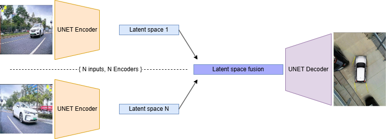

# XN-Project 11: Latent Multi-View Fusion for Bird’s-Eye View
BirdFusion uses transformer-based autoencoders to extract and fuse latent features from multiple RGB inputs around a vehicle, generating a coherent bird’s-eye view for enhanced spatial perception.

## Code structure
You must create as many folders as you consider. You can use the proposed structure or replace it by the one in the base code that you use as starting point. Do not forget to add Markdown files as needed to explain well the code and how to use it.

## Example Code
The given code is a simple CNN example training on the MNIST dataset. It shows how to set up the [Weights & Biases](https://wandb.ai/site) package to monitor how your network is learning, or not.

Before running the code you have to create a local environment with conda and activate it. The provided [environment.yml](https://github.com/XarNeu-EngDades/project24-25-11/environment.yml) file has all the required dependencies.

Check in the _environment.yml_ file that the CUDA version specified matches yours! You can remove the line if you are not using a GPU.

Run the following command:
``
conda env create --file environment.yml
``
to create a conda environment with all the required dependencies and then activate it:
```
conda activate project-venv
```

To run the example code:
```
python main.py
```

Deactivate the conda environment with:
```
conda deactivate
```

If you include new dependencies, you can update the conda environment (after including the new packages in the .yml file) with:
```
conda env update --name project-venv -f environment.yml
```

## When cloning the repository:

Create a file, in the project directory, named _directories.yaml_ with the structure:

```yaml
dataset_dir: "/home/dakur/datasets"   # Carpeta amb tots els datasets
                                      # A dins, estaran: rosbag-8-5-2025/, rosbag-2-5-2025/...
results_dir: "/home/dakur/results"    # Carpeta on es guardaran els resultats dels experiments
                                      # A dins, estaran: experiment1/, experiment2/...
```

This file is used to store the path to the dataset directory. This is used to avoid overwriting other people's directories.yaml file (different in each PC).


## Inspiration
[Paper](https://arxiv.org/abs/2005.04078) - A Sim2Real Deep Learning Approach for the
Transformation of Images from Multiple Vehicle-Mounted Cameras
to a Semantically Segmented Image in Bird’s Eye View
[Code Repository](https://github.com/ika-rwth-aachen/Cam2BEV) - Cam2BEV repository

## Hypoteses
This project is built upon the following hypotheses:

1. **Semantic-to-BEV Transformation**  
   A semantically segmented input from multiple vehicle-mounted cameras contains enough spatial and contextual information to generate an accurate Bird’s Eye View (BEV) representation using deep learning models.

2. **Simulation-to-Real Generalization**  
   A model trained on semantically segmented data from high-fidelity simulators (e.g., CARLA) can generalize well to new, unseen simulated environments and potentially to real-world scenarios.

3. **Robustness to Camera Failures**  
   The proposed model is capable of generating coherent BEV outputs even when one or more camera inputs are missing or partially corrupted, by leveraging the redundancy and spatial coverage of the remaining camera views.

## Proposed model architecture


## Data shape
- Cameras: torch.Size([B, C, D, W, H])
    - B: Batch size
    - C: Number of cameras
    - D: Number of channels (3)
    - W: Width of the image (300)
    - H: Height of the image (300)
- Bird's Eye View: torch.Size([B, D, W, H])
    - B: Batch size
    - D: Number of channels (3)
    - W: Width of the image (300)
    - H: Height of the image (300)

## Dataset structure
- root_dir
    - bev --> Bird's Eye View images
        - bev_1746196584_568510532.png
        - bev_1746196584_768572568.png
        - ...
    - img1 --> Camera 1 images
        - img1_1746196584_568510532.png
        - img1_1746196584_768572568.png
        - ...
    - imgN --> Camera 2 images
        - imgN_1746196584_568510532.png
        - imgN_1746196584_768572568.png
        - ...
    - ss_bev --> Bird's Eye View semantic segmentation images
        - ss_bev_1746196584_568510532.png
        - ss_bev_1746196584_768572568.png
        - ...
    - ss_img1 --> Camera 1 semantic segmentation images
        - ss_img1_1746196584_568510532.png
        - ss_img1_1746196584_768572568.png
        - ...
    - ss_imgN --> Camera 2 semantic segmentation images
        - ss_imgN_1746196584_568510532.png
        - ss_imgN_1746196584_768572568.png
        - ...

## Datasets link
[Datasets (OneDrive David)](https://uab-my.sharepoint.com/:f:/r/personal/1666540_uab_cat/Documents/datasets?csf=1&web=1&e=JeqGof)
## Diagrama link 
[Diagrama (draw.io)](https://app.diagrams.net/#G1GrRwB1r-dhbq5YlsHz2fLDPooo5X3mnF#%7B%22pageId%22%3A%22iRUM4EwLExCz9kBRzJAm%22%7D)
## Next steps:
- Remember: Parameterize everything!
- Afegir metriques per semantic segmentation  LUCIA
  - Accuracy
  - F1 score
  - Precision?
- Matrix confussion classes
- Dades a RAM/GPU per menys acces al disc
- Fer servir transformers per RGB
  - Hauria d'ajudar a reconstruir millor les imatges amb les "poques" dades RGB que tenim
- Mes tipus de loss per semantic segmentation ALBERT
  - SSIM
  - PSNR
  - LPIPS
  - Dice loss
- RGB cameras to (semantic segmentation + RGB) BEV 
- Discriminador per rgb pix2pix
- Diferent pes pre classes per loss crossentropu (+ pes a carretera, vores...)
---------------------------------- ASSEGURAR BON SEMANTIC->SEMANTIC ABANS - Adrià
  - Output of U-Net: RGB (3) + Segmentation (N classes)
- Upscale the output (hyper resolution) --------------------------------------------- INVIABLE DE MOMENT
  - Separate model trained with HD BEV images
- Random search for hyperparameters ------------------------------------------------- TRIGA MOLT, DEIXAR PER AL FINAL
  - Learning rate / scheduler
  - Batch size
  - Number of epochs
  - Optimizer

## Work done:
- **Data preparation**: 
  - DataLoader for the dataset
  - Training and validation loop
  - Parameterization approach
  - Modules creation for the model
  - Wandb integration (monitoring and reports)
  - Initial semantic segmentation implementation

- **More data!**
  - Use lots of CARLA maps for training (multiple scenarios per map)
  - Separate map / scenarios for testing
- **Learning rate scheduler in the training loop**
  - Description: 
    - Quan la loss no baixa multiplicar per 0,5 el learning rate, per exemple
    - Cada 'x' epochs reduir la learning rate
- **Proper Semantic Segmentation implementation:**
  - Mapping to classes instead of using RGB (in/out) --> [CARLA Documentation](https://carla.readthedocs.io/en/latest/ref_sensors/#semantic-segmentation-camera)
  - Using a proper loss function for multiclass (CrossEntropyLoss/Dice)
- **Different Latent space fusion methods**
  - Mean
  - Max/min pooling
  - Triar el que funcioni millor després de provar-los
- **Penalty for unsharp edges (RGB)**
  - MSE(reduction="none") + Canny Map = mapa d'errors per píxel i detector d'edges Canny. Multiplicar el mapa d'errors pel de edges per penalitzar més els errors en zones d'edges. 
  - Provar altres errors.
- **Add Camera Failure**

- Semantic segmentation image preprocessing
  - Maximize GPU usage

## Contributors
- David Morillo Massagué
    - NIU: 1666540
    - Email: 1666540@uab.cat
- Adrià Muro Gómez
    - NIU: 1665191
    - Email: 1665191@uab.cat
- Lucia Garrido Rosas
    - NIU: 1671463
    - Email: 1671463@uab.cat
- Albert Guillaumet Mata
    - NIU: 1672344
    - Email: 1672344@uab.cat

Xarxes Neuronals i Aprenentatge Profund
Grau d'Enginyeria de Dades, 
UAB, 2025
