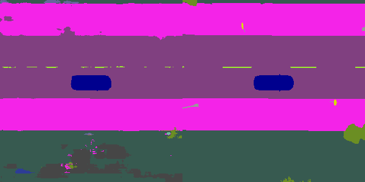
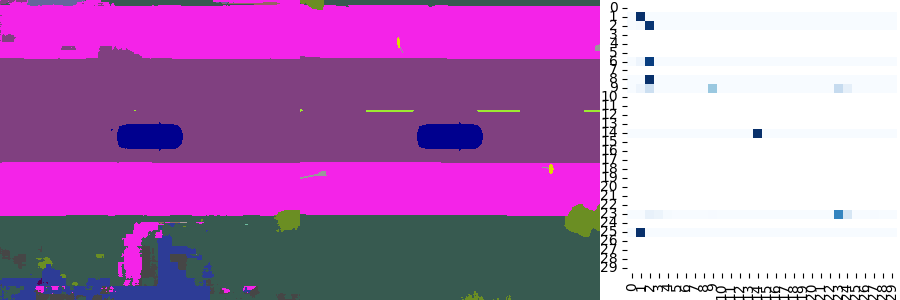
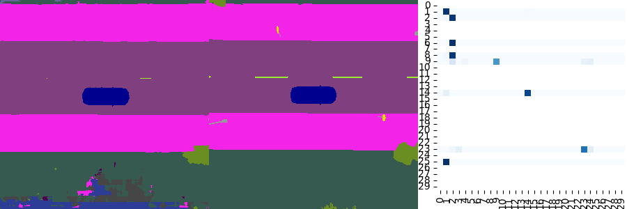

# Training results

## Inference:

## RGB UNET MSE

## RGB UNET SSIM

## RGB UNET SSIM + LPIPS + MSE

## RGB UNET encoder and Transformer decoder

## Semantic Segmentation UNET

## Semantic Segmentation UNET 4 cameras

## Semantic Segmentation UNET 8 cameras, 100 epochs

## [WandB RGB GridSearch Report](https://api.wandb.ai/links/dakur-universitat-aut-noma-de-barcelona/10yvnvum)

Best value single experiment: https://wandb.ai/dakur-universitat-aut-noma-de-barcelona/BEV-Reconstruction/runs/b0vh2phu?nw=nwuserdakur

## [WandB Semantic Segmentation GridSearch Report](https://api.wandb.ai/links/dakur-universitat-aut-noma-de-barcelona/i0rdcbzb)

Best value single experiment: https://wandb.ai/dakur-universitat-aut-noma-de-barcelona/BEV-Reconstruction/runs/bkhn5o4e?nw=nwuserdakur

## [Data Amount Report (do we need more data for RGB?)](https://api.wandb.ai/links/dakur-universitat-aut-noma-de-barcelona/vi6xajz4)

## [Transformers Tests](https://api.wandb.ai/links/dakur-universitat-aut-noma-de-barcelona/qo6db6dk)

## [Weights per class in Semantic Segmentation](https://wandb.ai/dakur-universitat-aut-noma-de-barcelona/BEV-Reconstruction/runs/w1qqf3dd?nw=nwuserdakur)

A destacar:
- Diferencia ús GPU Semantic Segmentation --> Preprocessing imatges de PNG a Classes (array numpy)
- Possible discriminador per comparar sortides rgb (GAN), a futur.
- MSE 0.02 és coherent --> Mitja de 14% error per foto a nivell de pixel
- Cal millorar transformer --> Menys capes encoder, espai latent més gran per menys blur de sortida
- Implementació pesos per classes CrossEntropy Semantic Segmentation
- GridSearch RGB UNET i Semantic Segmentation
- Execució amb diferents quantitats de dades --> Són necessaries mes dades?